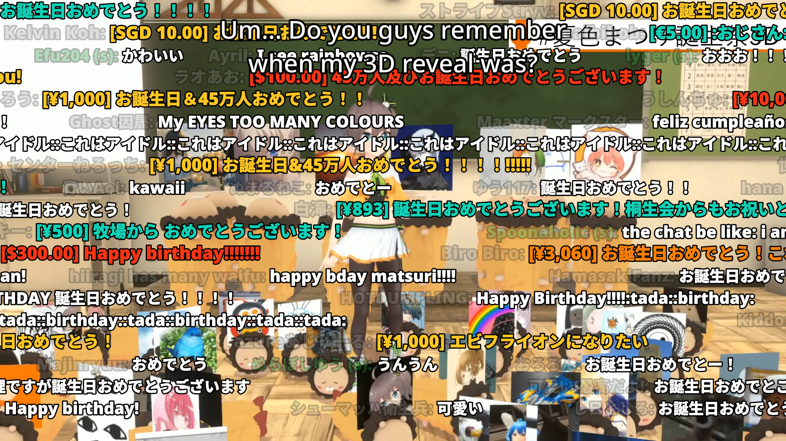

# YouTube Danmaku

Loosely based on the [W3C Bullet Chatting Proposal](https://w3c.github.io/danmaku/).

Downloading the chat replay using youtube-dl is tracked in [ytdl-org/youtube-dl#25874][1]
and there's an open PR at [ytdl-org/youtube-dl#26240][2].

Example in [mpv](https://mpv.io/):

[1]: https://github.com/ytdl-org/youtube-dl/issues/25874
[2]: https://github.com/ytdl-org/youtube-dl/pull/26240
